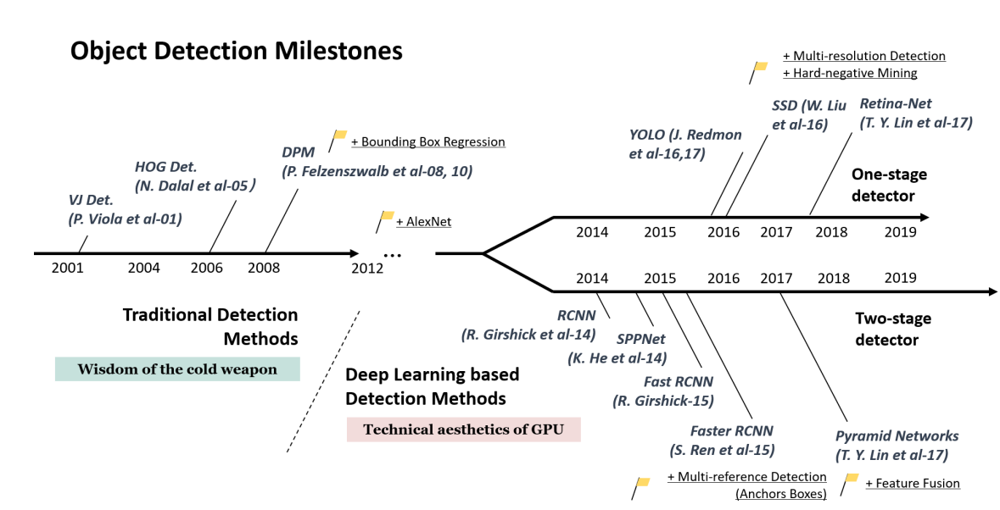

# 혈중알코올농도 예측을 위한 Bottle Detection 및 Classification 모델 학습

(2023.04 ~ 2023.06)

## 주제

이 프로젝트에서는 술자리 사진에서 술을 탐지하고, 탐지한 술의 종류를 분류하는 모델을 학습하는 것을 목표로 한다. 이 결과와 사전입력한 사용자 데이터를 통해 위드마크 공식(부록-캡쳐2)으로 술자리사진에서 한명당 혈중알코올 농도를 대략적으로 예측할수 있다.

## YOLO, RCNN

오브젝트 디텍션모델은 아래와같이 2가지 종류로 나뉘어서 발전하고있다.

술병개수를 찾는것은 실시간 여부가 중요하지 않기때문에 속도가 느리고 성능이 좋다고 알려진 Faster R-CNN 의 결과가 더 좋을것으로 예상했지만 더 최신모델인 YOLO가 정확성도 더 좋았다.

yolo는 실시간으로 물체를 찾기위해 만든 모델로 관심영역(ROI)를 찾고 객체 분류와 위치 선정을 동시에 하는 모델이다. 두번째는 FasterR-CNN 으로 두단계를 따로 사용합니다. 따라서 Faster R-CNN은 속도가 느리지만 정확도가 좋고 YOLO는 속도는 빠르지만 정확도가 낮다고 알려져있다.

yolo에서 하이퍼파라미터와 데이터셋을 아래와같이 순차적으로 변경하면서 개선해보았다.

1.pretrained weight, 2.yolo의 버전, 3.epoch, 4.batch-size, 5.yolo모델의 크기, 6.병의 색 구분 라벨링, 7.Data augmentation, 8.병목부분이미지로 학습

술병 Detection에 특화된 아이디어는 병목부분 이미지학습, 병의 색을 구분해서 라벨링 두개가 있다.

---

## 결과 분석

첫번째로 yolo라는 모델을 사용해보았는데 대중적으로 많이 알려진 v5(2020)부터 사용해서 시작 weight값을 random과 pretrained를 비교해보았다.

random weight의 epoch-loss그래프

random weight로 학습을 시작한 경우 

COCO로 학습된 pretrained dataset으로 시작한 경우

병만 찾으면 되는 문제특성상 random weight로도 잘학습될 것으로 예상했는데 mAP50-95가 1프로도안될정도로 성능이 낮았다.

반면에 Yolo에서 마이크로소프트의 coco data set으로 학습된 80개의 카테고리를 분류하는 pretrained weiight가 모델의 크기별로(nano, small, midium, large, xlarge) 있는데 small모델의 weight를 초기값으로 학습했을땐 전체 mAP50-95가 0.629으로 Pretrained weigh를 쓰는것만으로 62%로 높아졌다.

공통된 하이퍼파라미터는 40에폭, 16베치사이즈, 자동optimizer, 이미지사이즈 640, yolo 모델크기는 small을 사용했다. 자동 optimizer을 사용해서 Adam등이 learning late를 적절히 변경해준다고 가정한다.
앞으로 모델의 대략적인성능비교는 validation의 전체 mAP50-90으로 비교한다.

두번째로 yolov8을 사용해보았는데 yolov8은 이전버전에 비해 객체 추적에서 성능이 많이좋아졌다고 알려져있지만 최신버전이 성능이 좋을것같아서 시도해보았다. 똑같은 하이퍼 파라미터에서 mAP50-95가 0.629 에서 0.639로 약 1%증가했다. yolov8에서는 nano모델을 사용했는데 증가한 부분이 놀라웠다.

세번째로 loss그래프의 기울기가 높아서 더 학습하면 좋아질것으로 예상하여 에폭을 40에서 100으로 증가시켜 비교해 보았다. mAP50-95가 0.639 에서 0.664로 약 3%증가했다. loss그래프상 더 학습시키면 내려갈수 있을것같지만 시간관계상 앞으로 100epoch로 테스트한다.

epoch 40

epoch 100

네번째로 batch size를 16에서 64로 바꾸었는데 vram사용량이 4.5배 증가하고 시간이 2배 증가했다. back propagation에서 연산량이 늘어나도 횟수는 줄어들었을텐데 back propagation 회수보다 연산량의 부하가 더큰것으로 예상된다. 그리고 성능은 0.664에서 0.656으로 감소했다. 잦은 weight업데이트가 결과를 더 좋게하는것으로 이해했다.

다섯번째로 yolov8의 모델크기를 nano에서 midium으로 바꾸어서 비교해보았다.

nano의 파라미터 개수는 3백만개이고 midium의 파라미터의 개수는 25백만개로 8배차이가 난다. 그만큼 vram은 2g에서 6.7g로 약 3.5배 증가했고.  시간은 10분에서 17분으로 약 2배 증가했다. 그리고 성능은 0.664 -> 0.685로 2%로 생각보다 많이 좋아졌다.

여섯번째로 단순히 소주병 맥주병으로 라벨링하는게 아닌 병의 색으로도 구분지어서 라벨링했을때의 정확도를 비교해보았습니다. ex) soju → soju-green 과 soju-jinro 두가지로 구분.

결과는 val mAP가 0.685 ->0.668 로 2% 줄어들었다.

기존에는 각 술종류 별로 데이터 분포가 1:1로 좋았지만 그중에서 색을 나누면서 분포가 달라지게 되며 성능이 낮아지게 된것같다. 

병의 색상 구분전

병의 색상 구분후

하지만 같은술의 색 구분은 목적에서 벗어나므로 같은술에서의 에러를 제외하면 높을수도 있을것같다고  생각했는데 다음의 계산을 보면 아니라는걸 알수있다.

141/(141+1+1+20) = 0.8650306748

(22+39+83)/(22+3+8+39+8+83+1+1+10) = 0.82285714285

confusion matrix를 통해 병맥주에대해서 3가지 white, green, brown결과를 합쳐서 precision을 계산해보았는데 0.86에서 0.82로 4%낮게 측정되었다. 아마도 모델안에서 다른색의 맥주병사이의 관계를 통해 맥주병에 대해 학습하는 내용이 있어서 합쳐서 계산하는게 더 좋게 학습되는것으로 생각했다.

병의 색상 구분전

병의 색상 구분후

일곱번째로 Augmentation을 하고 비교해보았다. Cutout은 30%의 큰박스를 두개만 잘라내어 병의 뒤로 가렸을 경우를 찾아내기를 바라며 학습하였고, 사진을 수평으로만 찍을것이라고 가정해서 rotation은 조금만하고 않았고 모델에서 병의 색을 사용해서 분류할 것이라고 생각하여 hue shift도 조금만했다. 하지만 시간만 3배로 걸리고 좋아지지 않아서 조금만 넣을 rotation과 hueshift를 없애고 2배로 증강해서 학습하였더니 0.1프로 성능이 좋아졌습니다. (데이터증강의 효과라기보다 학습량의 증가로인한 성능향상으로 생각된다.)

mAP의 변화는 0.668 -> 0.661 -> 0.669 으로 내려갔다가 올라왔다. 

마지막으로 병에 가려져서 인식되지 못하는 문제를 해결하기위해 병복부분으로 바운딩박스를 줄여서 학습시킨결과 mAP값 0.669 에서 0.569로 많이 줄어들었지만 가려진 뒷 병의 목부분을 잘찾을때가 많은걸 확인했다. 성능이 낮게 나온이유는 병목부분이 전체보다 특징점이 적고 위치상 radial distortion에 취약해서인지 하나도 못찾는 경우가 많이있어서 mAP가 낮게 측정된 것 같다. 그리고 Rotation 증강으로는 위에서봤을때와 아래에서 봤을때를 구분못하기때문에 다양한 방향에서 찍은 데이터가 많이 필요할것같다. 데이터만 충분하다면 병복부분이 가려진병을 더잘찾을것으로 예상된다.

병이미지로 학습 한결과

병목 이미지로 학습한결과 뒤의 맥주병목을 찾지만 진로소주를 감지하지 못했다.

---

## 어려웠던 점

이미 만들어진 술병데이터셋이 없어서 웹에서 직접 찾아야 한점이 어려웠다. 같은 이미지가 들어갈때도 많았고 라벨링실수도 많이있어서 어려웠다.

제안 2의 yolo부분에서는 모델의 사이즈나, epoch를 키월때 학습시간이 오래걸린점과 560장의 이미지에서 여러술병들이 있는데 병목부분으로 줄이는 작업과 색별로 라벨링을 새로하는 부분이 고되었다.

---

## 참고문헌

- PyTorch & 파이토치 한국 사용자 모임, Finetuning Torchvision Models,
    
    [https://tutorials.pytorch.kr/beginner/finetuning_torchvision_models_tutorial.html](https://tutorials.pytorch.kr/beginner/finetuning_torchvision_models_tutorial.html)
    
- yolov5 docs
    
    [https://docs.ultralytics.com/yolov5/tutorials/train_custom_data/](https://docs.ultralytics.com/yolov5/tutorials/train_custom_data/)
    
- yolov8 docs
    
     [https://docs.ultralytics.com/modes/train/#usage-examples](https://docs.ultralytics.com/modes/train/#usage-examples)
    

---

## 부록

- 캡쳐1 roboflow

Labeling

데이터셋분리, 전처리, Augmentation

생성된 데이터셋의 버전관리

- 캡쳐2 위드마크 공식

- Bokeh를 이용한 t-SNE Vector Analysis

색상별로 나눈 bottle이미지 데이터

생상별로 나눈 bottle-top이미지 데이터

술의 종류로 나눈 bottle이미지 데이터셋

술의 종류로 나눈 bottle-top이미지 데이터셋